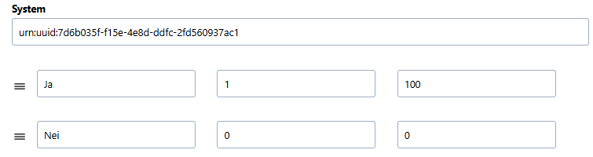
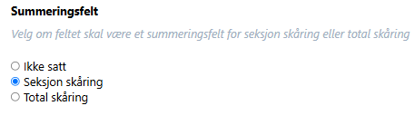
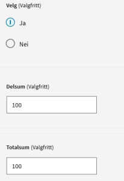
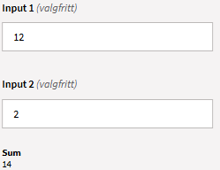
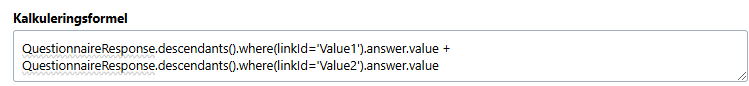
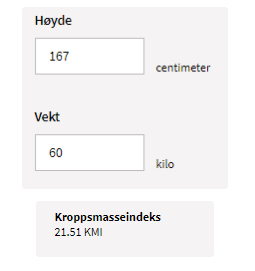

# @helsenorge/refero

React component that consumes a [FHIR Questionnaire](https://hl7.org/fhir/R4/questionnaire.html) object and renders it as a form.

## PeerDependencies

- [react](https://www.npmjs.com/package/react)
- [react-dom](https://www.npmjs.com/package/react-dom)
- [redux](https://www.npmjs.com/package/redux)
- [react-redux](https://www.npmjs.com/package/react-redux)
- [dompurify](https://www.npmjs.com/package/dompurify)
- [@helsenorge/file-upload](https://www.npmjs.com/package/@helsenorge/file-upload)
- [@helsenorge/datepicker](https://www.npmjs.com/package/@helsenorge/datepicker)
- [@helsenorge/autosuggest](https://www.npmjs.com/package/@helsenorge/autosuggest)
- [@helsenorge/designsystem-react](https://www.npmjs.com/package/@helsenorge/designsystem-react)

## Dependencies

- [firepath](https://www.npmjs.com/package/firepath)
- [marked](https://www.npmjs.com/package/marked)
- [uuid](https://www.npmjs.com/package/uuid)
- [react-collapse](https://www.npmjs.com/package/react-collapse)
- [react-hook-form](https://www.npmjs.com/package/react-hook-form)
- [date-fns](https://www.npmjs.com/package/date-fns)
- [classnames](https://www.npmjs.com/package/classnames)
- [@helsenorge/core-utils](https://www.npmjs.com/package/@helsenorge/core-utils)
- [@helsenorge/eslint-config](https://www.npmjs.com/package/@helsenorge/eslint-config)

## Example usage

```tsx
import React from 'react';
import { Provider } from 'react-redux';
import { configureStore } from '@reduxjs/toolkit';
import { Refero, rootReducer } from '@helsenorge/refero';

const store = configureStore({ reducer: rootReducer, middleware: getDefaultMiddleware => getDefaultMiddleware() });

const App = () => {
    return (
      <Provider store={store}>
        <Refero
          questionnaire={...}
          questionnaireResponse={...}
          resources={...}
          onCancel={...}
          onSave={...}
          onSubmit={...}
          promptLoginMessage={...}
          onRequestAttachmentLink={...}
          onOpenAttachment={...}
          onDeleteAttachment={...}
          uploadAttachment={...}
          loginButton={...}
          authorized
          sticky
          pdf
          onRequestHelpButton={...}
          onRequestHelpElement={...}
          attachmentMaxFileSize={...}
          attachmentMaxFileSizePerFile={...}
          attachmentValidTypes={...}
          attachmentErrorMessage={...}
          validationSummaryPlacement={...}
          onChange={...}
          onRenderMarkdown={...}
          syncQuestionnaireResponse
          blockSubmit={...}
          language={...}
          validateScriptInjection={...}
          autoSuggestProps={...}
          submitButtonDisabled={...}
          saveButtonDisabled={...}
          fetchValueSet={...}
          fetchReceivers={...}
          onFieldsNotCorrectlyFilledOut={...}
          onStepChange={...}
          renderCustomActionButton={...}
          onFormViewChange={...}
        />
      </Provider>
    );
};
```

## Props

| Name                          | Required | Type                       | Default | Description                                                                                                                                                         |
| ----------------------------- | -------- | -------------------------- | ------- | ------------------------------------------------------------------------------------------------------------------------------------------------------------------- |
| questionnaire                 |          | Questionnaire              | null    | FHIR Questionnaire object                                                                                                                                           |
| questionnaireResponse         |          | QuestionnaireResponse      | null    | FHIR QuestionnaireResponse object                                                                                                                                   |
| resources                     |          | Resources                  | null    | Resources object                                                                                                                                                    |
| onSubmit                      | true     | callback                   |         | Callback when user submits the form                                                                                                                                 |
| onSave                        | true     | callback                   |         | Callback when user saves the form                                                                                                                                   |
| onCancel                      | true     | callback                   |         | Callback when user cancels the form                                                                                                                                 |
| uploadAttachment              |          | callback                   | null    | Callback when user uploads attachment                                                                                                                               |
| onDeleteAttachment            |          | callback                   | null    | Callback when user deletes attachment                                                                                                                               |
| onOpenAttachment              |          | callback                   | null    | Callback when user opens attachment                                                                                                                                 |
| onRequestAttachmentLink       |          | callback                   | null    | Callback when the form needs to render a link to an attachment                                                                                                      |
| attachmentMaxFileSize         |          | number                     | 25M     | Max allowed file size for attachments in bytes. Default is 25M                                                                                                      |
| attachmentMaxFileSizePerFile  |          | number                     | 20M     | Max allowed file size per file for attachments in bytes. Default is 20M                                                                                             |
| attachmentValidTypes          |          | string[]                   | ...     | List of allowed mime types for attachments. Default allowed types are: image/jpeg, image/png, application/pdf                                                       |
| attachmentErrorMessage        |          | string                     | null    | Text shown when file-upload fails to validate                                                                                                                       |
| promptLoginMessage            |          | callback                   | null    | Callback when the form needs to notify the user about authentication                                                                                                |
| loginButton                   | true     | JSX.Element                |         | JSX for when the form needs to render a login button                                                                                                                |
| authorized                    | true     | boolean                    |         | Whether or not the user is authorized/authenticated                                                                                                                 |
| pdf                           |          | boolean                    | false   | Renders the form without interactive elements                                                                                                                       |
| sticky                        |          | boolean                    | false   | Whether the actionbar (bar with buttons send/save) should be sticky                                                                                                 |
| onRequestHelpButton           |          | callback                   | null    | Callback when the form needs to render a help button                                                                                                                |
| onRequestHelpElement          |          | callback                   | null    | Callback when the form needs to render a help element (help text)                                                                                                   |
| validationSummaryPlacement    |          | ValidationSummaryPlacement | null    | Controls the placement of the form validation summary                                                                                                               |
| onChange                      |          | callback                   | null    | Callback when user enters an answer                                                                                                                                 |
| onRenderMarkdown              |          | callback                   | null    | Callback when the form needs to render markdown                                                                                                                     |
| syncQuestionnaireResponse     |          | boolean                    | false   | Will try to synchronize a Questionnaire and QuestionnaireResponse object                                                                                            |
| fetchValueSet                 |          | callback                   | null    | Callback when an autosuggest field will fetch data                                                                                                                  |
| autoSuggestProps              |          | AutoSuggestProps           | null    | Config for when and autosuggest field will call fetchValueSet                                                                                                       |
| blockSubmit                   |          | boolean                    | false   | Whether the form is disabled or not                                                                                                                                 |
| language                      |          | string                     | null    | Which locale is used for date related components (only en-gb and nb-no are supported)                                                                               |
| validateScriptInjection       |          | boolean                    | false   | Whether script injection validation should be performed for string and text inputs                                                                                  |
| submitButtonDisabled          |          | boolean                    | false   | Whenther the submit button should be disabled or not                                                                                                                |
| saveButtonDisabled            |          | boolean                    | false   | Whenther the save button should be disabled or not                                                                                                                  |
| fetchValueSet                 |          | callback                   |         | Callback when user triggers autosuggest fields                                                                                                                      |
| fetchReceivers                |          | callback                   |         | Callback when the receiver component is mounted                                                                                                                     |
| onFieldsNotCorrectlyFilledOut |          | callback                   |         | Callback when a field is incorrectly filled out                                                                                                                     |
| onStepChange                  |          | callback                   |         | Callback when the current step in step-views changes                                                                                                                |
| useFormProps                  |          | UseFormProps               |         | Additional options passed to `react-hook-form`'s `useForm` hook.                                                                                                    |
| renderCustomActionButtons     |          | callback                   |         | A callback function that allows consumers to render their own custom buttons.                                                                                       |
| onFormViewChange              |          | callback                   |         | A callback function that is called when the form is initialized or if the form changes (example: step change). It accepts a ref of the element that wraps the form. |

### `questionnaire: Questionnaire`

This is the questionnaire to be rendered. It must be a [`Questionnaire`](https://hl7.org/fhir/R4/questionnaire.html) object.

### `questionnaireResponse: QuestionnaireResponse`

This is the object that reflects the users answers. If the property is not specified, an empty
[`QuestionnaireResponse`](https://hl7.org/fhir/R4/questionnaireresponse.html) will be generated.

### `resources: Resources`

This object, of type [`Resources`](#Resources), specifies all the different texts the component makes use of.

### `authorized: boolean`

When this property is `true`, the form is rendered as normal, with submit and save buttons. When it is `false` the form is rendered without
submit and save buttons, and while the user is allowed to fill out the form, at the first attempt to do so, a callback to
`promptLoginMessage` is fired.

### `pdf: boolean`

When this property is `true`, the form is rendered in a read-only manner suitable for printing, when `false`, the form is rendered as usual.

### `sticky: boolean`

When this property is `true`, the form renders the actionbar as sticky.

### `attachmentMaxFileSize: number`

Max file size in bytes allowed for attachments. Default is 25M.

### `attachmentValidTypes: MimeTypes[]`

List of allowed mime types for attachments. Default allowed types are image/jpeg, image/png, application/pdf

### `validationSummaryPlacement: ValidationSummaryPlacement`

Controls the placement of the form validation summary. See ['ValidationSummaryPlacement'](#ValidationSummaryPlacement) for possible values.
If not specified, it defaults to ValidationSummaryPlacement.Top

### `syncQuestionnaireResponse: boolean`

Provides limited assistance with synchronizing a Questionnaire and QuestionnaireResponse object. If an item is declared in the
Questionnaire, but is missing from the QuestionnaireResponse, it will try to synthesize an item with any potential children. Likewise, if an
item has been removed from the Questionnaire, it will be removed from the QuestionnaireResponse. It also supports limited help when an item
has changed its type, but only in the case where an answer element is provided in the QuestionnaireResponse item. It does not take any
extension into consideration when creating new items.

In addition it will convert old linkIds for repeated items containing a caret (^) into new linkIds without. Eg. it will transform linkIds of
the form X^Y into just X, by stripping everything from the caret to the end of the linkId.

### `autoSuggestProps: AutoSuggestProps`

Configuration for when autosuggest fields should call `fetchValueSet`. `minSearchCharacters` is the minumum number of letters which must be
typed before `fetchValueSet` will be called. Default value is 0. `typingSearchDelay` is the amount of milliseconds to wait after the user
stop typing before calling `fetchValueSet`. Default value is 500.

## Callback API

### `onSubmit: () => void`

This callback is called when the user requests the current form to be submitted.

### `onSave: () => void`

This callback is called when the user requests the current form to be saved.

### `onCancel: () => void`

This callback is called when the user requests the current form to be cancled.

### `uploadAttachment: (files: UploadFile[], onSuccess: (attachment: Attachment) => void) => void`

This callback is called when the user requests uploading an attachment. The callback is called with the following arguments:

- `files: UploadFile[]` An array of [`UploadFile`](https://developer.mozilla.org/en-US/docs/Web/API/File) objects to be be uploaded.

- `onSuccess: (attachment: Attachment) => void` Call this callback to indicate success

### `onDeleteAttachment: (fileId: string, onSuccess: () => void) => void`

This callback is called when the user requests deleting an attachment. The callback is called with the following arguments:

- `fileId: string` This indicates which file the user is requesting to delete
- `onSuccess: () => void` Call this callback to indicate success.

### `onOpenAttachment: (fileId: string) => void`

This callback is called when the user requests to open an attachment. The callback is called with the following arguments:

- `fileId: string` This identifies the attachment, as described under `onDeleteAttachment`.

### `onRequestAttachmentLink: (fileId: string) => string`

This callback is called when the form needs to render an `<a href>`-type link. The callback should return a link to the the attachment. The
callback is called with the following arguments:

- `fileId: string` This identifies the attachment, as described under `onDeleteAttachment`.

### `promptLoginMessage: () => void`

This callback is called when the form needs to notify the user about authentication. The callback could f.ex. show an alertbox to that
effect.

### `onRequestHelpButton: (item: QuestionniareItem, itemHelp: QuestionnaireItem, helpType: string, helpText: string, opening: boolean) => JSX.Element`

This callback is called when the form encounters an element with help. The callback should return a JSX.Element which is placed after the
items label. If this is not specified, a default implementation is provided. The callback is called with the following arguments:

- `item: QuestionnaireItem` This is the item for which the help button is about to be rendered.
- `helpItem: QuestionnaireItem` This is the item containing the raw help text.
- `helpType: string` Type of help, either "help" or "help-link".
- `helpText: string` The help text, either as plain text or html (in the case the help item had markdown)
- `opening: boolean` This boolean indicates whether the help text is visible or not (open or closed)

### `onRequestHelpElement: (item: QuestionnaireItem, itemHelp: QuestionniareItem, helpType: string, helpText: string, opening: boolean => JSX.Element`

This callback is called when the form encounters an element with help. The callback could return a JSX.Element which would be placed after
the items label. If this is not specified, a default implementation is provided. The callback is called with the following arguments:

- `item: QuestionnaireItem` This is the item for which the help element is about to be rendered.
- `helpItem: QuestionnaireItem` This is the item containing the raw help text.
- `helpType: string` Type of help, either "help" or "help-link".
- `helpText: string` The help text, either as plain text or html (in the case the help item had markdown)
- `opening: boolean` This boolean indicates whether the help text is visible or not (open or closed)

### `onChange: (item: QuestionnaireItem, answer: QuestionnaireResponseAnswer, actionRequester: IActionRequester, questionnaireInspector: IQuestionnaireInspector) => void`

This callback is called when the user enters an answer. The callback is called with the following arguments:

- `item: QuestionnaireItem` This is the item the user answered.
- `answer: QuestionnaireResponseAnswer` This is the actual answer the user entered.
- `actionRequester: IActionRequester` Instance that facilitates programmatic changes to the questionnaire response.
- `questionnaireInspector: IQuestionnaireInspector` Instance that lets users query the questionnaire for questionnaire items and
  questionnaireResponse items.

### `onRenderMarkdown: (item: QuestionnaireItem, markdown: string) => string`

This callback is called when the form needs to render markdown. It should return a HTML string representation of the markup. The callback is
called with the following arguments:

- `item: QuestionnaireItem` This is the item with the markdown.
- `markdown: string` The actual markdown.

### `fetchValueSet: (searchString: string, item: QuestionnaireItem, successCallback: (valueSet: ValueSet) => void, errorCallback(error: string) => void) => void`

This callback is called when an autosuggest field need to load data. It should call either successCallback with a valueSet, or errorCallback
with an error message.

- `searchString: string` The value currently typed in the autosuggest field.
- `item: QuestionnaireItem` This is the choice or open-choice item to load data for.
- `successCallback: (valueSet: ValueSet) => void` The function to call to return a list of values to the autosuggest field, which will be
  displayed as a list to the user.
- `errorCallback(error: string) => void)` The function to call to return an error message to the autosuggest field, which will be displayed
  to the user.

### `fetchReceivers: (successCallback: (receivers: OrgenhetHierarki[]) => void, errorCallback: () => void) => void`

This callback is called when a receiver component needs to load data. It should call either successCallback with a list of OrgenhetHierarki
objects, or errorCallback with an error message.

- `successCallback: (receivers: OrgenhetHierarki[]) => void` The function to call to return a list of OrgenhetHierarki objects to the
  receiver component, which will be displayed as a set of choices to the user.
- `errorCallback(error: string) => void)` The function to call to return an error message to the receiver component, which will be displayed
  to the user.

### `onFieldsNotCorrectlyFilledOut: () => void`

This callback is called when a required field is not filled out, or if a field is incorrectly filled out.

### `onStepChange: (newIndex: number) => void`

This callback is called when the current step in a step-view changes. It takes in the parameter newIndex, which contains the new index that
the current index will be updated to. This can be used to make progress indicators display the correct step.

### `onFormViewChange: (focusedElement: HTMLElement) => void`

A callback function that is called when the form is initialized or if the form changes (example: step change). It accepts a ref of the
element that wraps the form.

# Scoring Functionality

## Description

To assign a value to a question to be used in scoring, use the **Answer option**.

### Marking a Field as a Scoring Field


The following codes are established to indicate that this element is used for scoring, as well as a code to specify that it is a question
(Question score):

```json
{
  "system": "http://ehelse.no/Score",
  "code": "score",
  "display": "score"
}

{
  "system": "http://ehelse.no/scoringFormulas",
  "code": "QS",
  "display": "Question score"
}
```

You have the option to assign an \`ordinalValue\`—a decimal number—for each choice, which can be used in scoring.



### Creating a Subtotal Field

Next, create a field for a subtotal, e.g., for all scoring values within a group.  
This should be a numeric or decimal value.



The following codes indicate that this is a **Section Score**:

```json
{
  "system": "http://ehelse.no/Score",
  "code": "score",
  "display": "score"
}

{
  "system": "http://ehelse.no/scoringFormulas",
  "code": "SS",
  "display": "Section score"
}
```

### Creating a Total Score Field

Finally, create a field for the total score, covering all scoring values in the entire form:

```json
{
  "system": "http://ehelse.no/Score",
  "code": "score",
  "display": "score"
}

{
  "system": "http://ehelse.no/scoringFormulas",
  "code": "TS",
  "display": "Total score"
}
```

### Example Form Layout



# Mathematical Expressions

## Description

### Examples:

#### Calculation: Integer, Decimal



In the sum field, the following is entered:



```
QuestionnaireResponse.descendants().where(linkId='Value1').answer.value + QuestionnaireResponse.descendants().where(linkId='Value2').answer.value
```

#### Calculation Using Quantity Data from Two Fields (Height and Weight to Calculate BMI)



In the sum field, the following is entered:

```
QuestionnaireResponse.descendants().where(linkId='Vekt').answer.value.value / ((QuestionnaireResponse.descendants().where(linkId='Hoyde').answer.value.value / 10000) * QuestionnaireResponse.descendants().where(linkId='Hoyde').answer.value.value)
```

> **Note:**  
> Use \`value.value\` when working with quantities. For other numeric values, only \`value\` is used in the expressions.

Custom units must follow the **FHIR Standard**:  
[Datatypes-definitions - FHIR v4.0.1](https://www.hl7.org/fhir/datatypes.html)

# Enum definitions

## `ValidationSummaryPlacement`

```ts
enum ValidationSummaryPlacement {
  Top = 'Top',
  Bottom = 'Bottom',
}
```

# Interface definitions

## `IActionRequester`

```ts
interface IActionRequester {
  addIntegerAnswer(linkId: string, value: number, index?: number): void;
  addDecimalAnswer(linkId: string, value: number, index?: number): void;
  addChoiceAnswer(linkId: string, value: Coding, index?: number): void;
  addOpenChoiceAnswer(linkId: string, value: Coding | string, index?: number): void;
  addBooleanAnswer(linkId: string, value: boolean, index?: number): void;
  addDateAnswer(linkId: string, value: string, index?: number): void;
  addTimeAnswer(linkId: string, value: string, index?: number): void;
  addDateTimeAnswer(linkId: string, value: string, index?: number): void;
  addQuantityAnswer(linkId: string, value: Quantity, index?: number): void;
  addStringAnswer(linkId: string, value: string, index?: number): void;

  clearIntegerAnswer(linkId: string, index?: number): void;
  clearDecimalAnswer(linkId: string, index?: number): void;
  clearBooleanAnswer(linkId: string, index?: number): void;
  clearDateAnswer(linkId: string, index?: number): void;
  clearTimeAnswer(linkId: string, index?: number): void;
  clearDateTimeAnswer(linkId: string, index?: number): void;
  clearQuantityAnswer(linkId: string, index?: number): void;
  clearStringAnswer(linkId: string, index?: number): void;

  removeChoiceAnswer(linkId: string, value: Coding, index?: number): void;
  removeOpenChoiceAnswer(linkId: string, value: Coding | string, index?: number): void;
}
```

`IActionRequester` facilitates programmatic updates of the `QuestionnaireResponse`. All the `add*`, `clear*` and `remove*` methods, will
queue a change event when called. This queue will then be processed when the callback finishes.

`linkId` is the linkId of the item to be updated. `value` is the value to update with. `index` is optional and defaults to `0`. It indicates
which instance of an item should be updated in case it is a repeatable item.

`removeChoiceAnswer` and `removeOpenChoiceAnswer` only removes answers in the case it is a check-box group. It is not possible to remove an
answer from a radio-button group or drop-down group.

## `IQuestionnaireInspector`

```ts
interface IQuestionnaireInspector {
  findItemWithLinkIds(linkIds: string[]): QuestionnaireItemPair[];
}
```

`IQuestionnaireInspector` lets the users query the state of the questionnaire for both `QuestionnaireItem` and `QuestionnaireResponse`.

## `Path`

```ts
interface Path {
  linkId: string;
  index?: number;
}
```

## `QuestionniareItemPair`

```ts
interface QuestionnaireItemPair {
  QuestionnaireItem: QuestionnaireItem;
  QuestionnaireResponseItems: ItemAndPath[];
}

interface ItemAndPath {
  item: QuestionnaireResponseItem;
  path: Path[];
}
```

## `TextMessage`

```ts
interface TextMessage {
  Title: string;
  Body: string;
}
```

## `UploadedFile`

```ts
// location: '@helsenorge/file-upload/components/dropzone'
interface UploadedFile {
  id?: string;
  name: string;
}
```

## `Resources`

```ts
interface Resources {
  confirmDeleteButtonText: string;
  confirmDeleteCancelButtonText: string;
  confirmDeleteHeading: string;
  confirmDeleteDescription: string;
  validationNotAllowed: string;
  formCancel: string;
  formSend: string;
  repeatButtonText: string;
  errorAfterMaxDate: string;
  errorBeforeMinDate: string;
  oppgiVerdi: string;
  oppgiGyldigVerdi: string;
  deleteButtonText: string;
  validationSummaryHeader: string;
  selectDefaultPlaceholder: string;
  supportedFileFormats: string;
  ikkeBesvart: string;
  formRequiredErrorMessage: string;
  deleteAttachmentText: string;
  uploadButtonText: string;
  autoSuggestLoadError: string;
  stringOverMaxLengthError: string;
  chooseFilesText: string;
  autosuggestNoSuggestions: string;
  skipLinkText: string;
  formSave: string;
  openChoiceOption: string;
  year_field_invalid: string;
  year_field_required: string;
  year_field_mindate: string;
  year_field_maxdate: string;
  yearmonth_field_month_placeholder: string;
  yearmonth_field_required: string;
  adresseKomponent_header: string;
  adresseKomponent_sublabel: string;
  adresseKomponent_velgHelseregion: string;
  adresseKomponent_velgHelseforetak: string;
  adresseKomponent_velgSykehus: string;
  adresseKomponent_velgAvdeling: string;
  adresseKomponent_skjemaSendesTil: string;
  adresseKomponent_feilmelding: string;
  adresseKomponent_loadError: string;
  adresseKomponent_velgKlinikk: string;
  adresseKomponent_velgSeksjon: string;
  adresseKomponent_velgSengepost: string;
  adresseKomponent_velgPoliklinikk: string;
  adresseKomponent_velgTjeneste: string;
  linkOpensInNewTab: string;
  nextStep: string;
  previousStep: string;
  maxCharactersText: string;
  attachmentError_minFiles: string;
  attachmentError_maxFiles: string;
  attachmentError_fileSize: string;
  attachmentError_fileType: string;
  dateError_invalid: string;
  dateError_time_invalid: string;
  dateLabel_january: string;
  dateLabel_february: string;
  dateLabel_march: string;
  dateLabel_april: string;
  dateLabel_may: string;
  dateLabel_june: string;
  dateLabel_july: string;
  dateLabel_august: string;
  dateLabel_september: string;
  dateLabel_october: string;
  dateLabel_november: string;
  dateLabel_december: string;
  dateFormat_ddmmyyyy: string;
  timeError_hours_digits: string;
  timeError_minutes_digits: string;
  dateLabel_year: string;
  dateLabel_month: string;
  attachmentError_minFiles_and_maxFiles: string;
  quantity_unit_sublabel: string;
  formOptional: string;
  formRequired: string;
  formAllOptional: string;
  formAllRequired: string;
  formRequiredInputs: string;
  formRequiredSingleCheckbox: string;
  formRequiredMultiCheckbox: string;
  formRequiredRadiobuttonList: string;
}
```

## `AutoSuggestProps`

```ts
interface AutoSuggestProps {
  minSearchCharacters: number;
  typingSearchDelay: number;
}
```

## `ValueSet`

```ts
interface ValueSet extends DomainResource {
  // ValueSet as defined by the FHIR standard
}
```

## `OrgenhetHierarki`

```ts
interface OrgenhetHierarki {
  OrgenhetId: number;
  Navn: string;
  EnhetType: EnhetType;
  EndepunktId: string | null;
  UnderOrgenheter: OrgenhetHierarki[] | null;
}

enum EnhetType {
  Region = 1,
  Foretak = 2,
  Sykehus = 3,
  Klinikk = 4,
  Avdeling = 5,
  Seksjon = 6,
  Sengepost = 7,
  Poliklinikk = 8,
  Tjeneste = 9,
}
```
